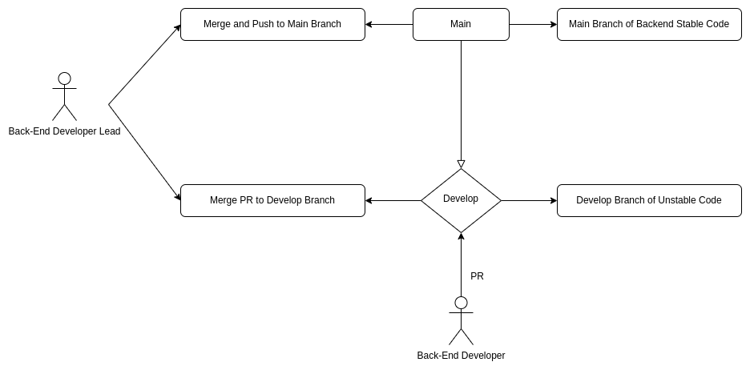
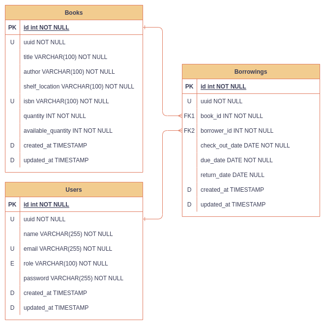

# Infrastructure Diagrams

## Repository Branches

This is the approach that I used in this repository to keep all branches clear.

## Database Design

This is the main database design I used.

### [Back to README](./README.md#auth)
